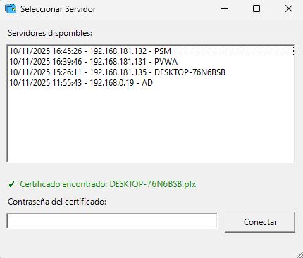

# 🖥️ Sistema de Control Remoto PowerShell

Sistema completo de administración remota de servidores Windows con autenticación SSL/TLS mediante certificados, logging avanzado, inventario automático y base de datos SQLite.

## 📋 Tabla de Contenidos

- [Características](#-características)
- [Requisitos](#-requisitos)
- [Inicio Rápido](#-inicio-rápido) 
- [Instalación](#-instalación)
- [Configuración Inicial](#-configuración-inicial)
- [Uso](#-uso)
- [Arquitectura](#-arquitectura)
- [Módulos](#-módulos)
- [Sistema de Inventario](#-sistema-de-inventario)
- [Seguridad](#-seguridad)
- [Troubleshooting](#-troubleshooting)
- [Contribuir](#-contribuir)
- [Licencia](#-licencia)

## ✨ Características

### 🔐 Seguridad
- **Autenticación SSL/TLS** con certificados X.509
- **Certificados de cliente** para autenticación mutua
- **Encriptación** de todas las comunicaciones
- **Logging completo** de sesiones y comandos

### 🛠️ Funcionalidades
- **Gestión de archivos** (copiar, mover, eliminar, buscar)
- **Gestión de procesos** (listar, iniciar, detener)
- **Gestión de servicios** (estado, iniciar, detener, reiniciar)
- **Gestión de software** (listar, instalar, desinstalar)
- **Información del sistema** (CPU, memoria, discos, red)
- **Visor de eventos** de Windows
- **Inventario automático** programado
- **Base de datos SQLite** para almacenamiento

### 📊 Inventario Automático
- Recopilación automática de información del sistema
- Almacenamiento en base de datos SQLite
- Programación mediante tareas de Windows
- Interfaz gráfica para visualización
- Exportación de reportes

## 📦 Requisitos

### Sistema Operativo
- Windows Server 2012 R2 o superior
- Windows 10/11 (para cliente)
- PowerShell 5.1 o superior

### Permisos
- **Servidor**: Administrador local
- **Cliente**: Administrador local (para algunas operaciones)

### Dependencias
- .NET Framework 4.7.2 o superior
- System.Data.SQLite (se instala automáticamente)

## 🚀 Inicio Rápido

### Guía de 5 Minutos para Primera Configuración

Esta guía te llevará desde cero hasta tener el sistema funcionando.

#### **Paso 1: Verificar Requisitos**

```powershell
# Verificar versión de PowerShell (debe ser 5.1 o superior)
$PSVersionTable.PSVersion

# Verificar versión de .NET Framework (debe ser 4.7.2 o superior)
Get-ChildItem 'HKLM:\SOFTWARE\Microsoft\NET Framework Setup\NDP\v4\Full\' | Get-ItemPropertyValue -Name Release | ForEach-Object { $_ -ge 461808 }

# Verificar que se ejecuta como Administrador
([Security.Principal.WindowsPrincipal][Security.Principal.WindowsIdentity]::GetCurrent()).IsInRole([Security.Principal.WindowsBuiltInRole]::Administrator)
```

**Versiones Recomendadas:**
- **PowerShell**: 5.1 (incluido en Windows 10/Server 2016+) o PowerShell 7.x
- **.NET Framework**: 4.8 (última versión estable)
- **System.Data.SQLite**: 1.0.118.0 (se instala automáticamente)

#### **Paso 2: Descargar e Instalar**

```powershell
# Clonar repositorio
git clone https://github.com/campossv/control-remoto-powershell.git
cd control-remoto-powershell

# O descargar ZIP y extraer
# Descargar desde: https://github.com/campossv/control-remoto-powershell/archive/refs/heads/main.zip
```

#### **Paso 3: Instalar Dependencias (IMPORTANTE)**

```powershell
# Ejecutar PowerShell como Administrador
# Clic derecho en PowerShell > "Ejecutar como administrador"

# Instalar System.Data.SQLite (requerido para base de datos)
.\Setup-SQLite.ps1

# Verificar instalación
Get-ChildItem -Filter "System.Data.SQLite.dll" -Recurse
```

**¿Qué hace Setup-SQLite.ps1?**
- Descarga System.Data.SQLite desde NuGet
- Instala las DLLs necesarias en la carpeta del proyecto
- Versión instalada: 1.0.118.0 (compatible con .NET Framework 4.6+)
- Tamaño: ~8 MB de archivos

#### **Paso 4: Inicializar Base de Datos**

```powershell

# Usar el debugger para crear BD vacía
.\Debug-InventoryDB.ps1

# Verificar que la base de datos se creó correctamente
Test-Path "Database\RemoteAdmin.db"
Get-Item "Database\RemoteAdmin.db" | Select-Object Name, Length, LastWriteTime
```

**Estructura de la Base de Datos:**
- **Tabla**: InventoryData
- **Campos**: ComputerName, CollectionDate, SystemInfo, HardwareInfo, NetworkInfo, SoftwareInfo, ServicesInfo, UpdatesInfo
- **Ubicación**: `Database\RemoteAdmin.db`

#### **Paso 5: Configurar Certificados SSL**

```powershell
# SERVIDOR: Generar certificado auto-firmado
.\Generar-Certificados.ps1

# Verificar certificado creado
Get-ChildItem Cert:\LocalMachine\My | Where-Object {$_.Subject -like "*ServidorRemoto*"}

```

#### **Paso 6: Configurar Firewall**

```powershell

# Mismo paso para recolectar inventario
New-NetFirewallRule `
    -DisplayName "Control Remoto Inventario (5000)" `
    -Direction Inbound `
    -LocalPort 5000 `
    -Protocol TCP `
    -Action Allow `
    -Profile Domain,Private

# Verificar regla creada
Get-NetFirewallRule -DisplayName "Control Remoto Inventario (5000)"

#Lentar el servicio de inventario
.\start-InventoryService.ps1

```

#### **Paso 7: Verificar Configuración (Recomendado)**

```powershell
# Ejecutar script de diagnóstico completo
.\Test-ServerSetup.ps1

# Este script verifica:
# - Versión de PowerShell y .NET
# - Permisos de administrador
# - Puerto disponible
# - Certificados SSL
# - Módulos instalados
# - Base de datos
# - Regla de firewall
```

**Si todas las verificaciones pasan, continuar al siguiente paso.**

#### **Paso 8: Iniciar agentes**

```powershell
# Permitir conexiones entrantes en el puerto 4430
New-NetFirewallRule -DisplayName "Control Remoto PowerShell" `
                    -Direction Inbound `
                    -LocalPort 4430 `
                    -Protocol TCP `
                    -Action Allow `
                    -Profile Domain,Private

# Verificar regla creada
Get-NetFirewallRule -DisplayName "Control Remoto PowerShell"

# Iniciar agente en los servidores (mantener ventana abierta)
.\agente.ps1

# Deberías ver:
# "Servidor SSL iniciado en el puerto 4430"
# "Esperando conexiones..."

#Iniciar la generación de inventario
.\Servidor-InventoryAgent.ps1 <IP del cliente>

#Programar la generación de inventario
.\Schedule-InventoryTask.ps1 -RemoteServer <IP del servidor> -Frequency Daily -Time "02:00"
#NOTA: Si tienes dudas en los parameros puedes digitar !?
```

**¿El servidor no inicia? Ejecutar `.\Test-ServerSetup.ps1` y ver sección de Troubleshooting más abajo.**

#### **Paso 9: Probar Conexión desde Cliente**

```powershell
# En otra máquina o ventana de PowerShell (como Administrador)

# Verficar la existencia del certificado en el agente remoto y el RAdmin .\Certificates\<RAdmin>


# Iniciar cliente GUI
.\RAdmin.ps1

# En la interfaz:
# 1. Ingresar IP del servidor
# 2. Ingresar contraseña del certificado
# 3. Clic en "Conectar"

```

#### **Paso 10: Verificar Funcionamiento**

```powershell
# Verificar logs de conexión
Get-Content "Logs\Session_*.log" -Tail 20

# Verificar datos en base de datos
.\Debug-InventoryDB.ps1

# Ver inventario en GUI
.\Ver-Inventario-GUI.ps1
```

### ✅ Checklist de Primera Configuración

- [ ] PowerShell 5.1+ instalado y verificado
- [ ] .NET Framework 4.7.2+ instalado
- [ ] Repositorio clonado/descargado
- [ ] `Setup-SQLite.ps1` ejecutado exitosamente
- [ ] Base de datos inicializada (`Database\RemoteAdmin.db` existe)
- [ ] Certificados SSL generados
- [ ] Regla de firewall creada
- [ ] Servidor iniciado sin errores
- [ ] Cliente conectado exitosamente
- [ ] Comando de prueba ejecutado

## 🚀 Instalación

### 1. Clonar el Repositorio

```powershell
git clone https://github.com/tu-usuario/control-remoto-powershell.git
cd control-remoto-powershell
```

### 2. Instalar SQLite

```powershell
.\Setup-SQLite.ps1
```

Este script descarga e instala automáticamente las DLLs necesarias de System.Data.SQLite.

### 3. Generar Certificados

#### Servidor
```powershell
.\Generar-Certificados.ps1
```

#### Agentes (copiar el .cer generado)
```powershell
Copy-Item -Path ".\Certificates\<RAdmin>.cer" -Destination "C:\Certificates\"
```


## ⚙️ Configuración Inicial

### Agente

1. **Configurar el puerto** (opcional, por defecto 4430):
   ```powershell
   # Editar agente.ps1, línea 11
   $port = 4430
   ```

2. **Iniciar el agente**:
   ```powershell
   .\agente.ps1
   ```

3. **Configurar firewall**:
   ```powershell
   New-NetFirewallRule -DisplayName "Control Remoto" -Direction Inbound -LocalPort 4430 -Protocol TCP -Action Allow
   ```

### RAdmin

1. **Configurar servidor de administracion remota**:
   - Editar en la GUI o modificar `RAdmin.ps1`

3. **Ejecutar cliente**:
   ```powershell
   .\RAdmin.ps1
   ```

## 📖 Uso

### RAdmin

El cliente incluye una interfaz gráfica completa:

1. **Conectar al servidor**:
   - Ingresar IP/hostname del servidor
   - Agrega la contraseña del certificado.
   - Clic en "Conectar"
 - 
2. **Ejecutar comandos**:
   - Usar los botones de la interfaz
   - O escribir comandos personalizados

3. **Ver logs**:
   - Panel de logs en tiempo real
   - Exportar logs a archivo

### Comandos Disponibles

#### Gestión de Archivos
```powershell
LISTAR_ARCHIVOS|C:\Ruta
COPIAR_ARCHIVO|C:\Origen|C:\Destino
MOVER_ARCHIVO|C:\Origen|C:\Destino
ELIMINAR_ARCHIVO|C:\Ruta\Archivo.txt
BUSCAR_ARCHIVO|C:\Ruta|*.txt
```

#### Gestión de Procesos
```powershell
LISTAR_PROCESOS
INICIAR_PROCESO|notepad.exe
DETENER_PROCESO|1234
```

#### Gestión de Servicios
```powershell
LISTAR_SERVICIOS
ESTADO_SERVICIO|wuauserv
INICIAR_SERVICIO|wuauserv
DETENER_SERVICIO|wuauserv
REINICIAR_SERVICIO|wuauserv
```

#### Información del Sistema
```powershell
INFO_SISTEMA
INFO_CPU
INFO_MEMORIA
INFO_DISCOS
INFO_RED
```

#### Visor de Eventos
```powershell
EVENTOS_SISTEMA|100
EVENTOS_APLICACION|100
EVENTOS_SEGURIDAD|100
EVENTOS_FILTRADOS|System|Error|100
```

## 🏗️ Arquitectura

```
ControlRemoto/
├── RAdmin.ps1                      # Cliente GUI principal
├── agente.ps1                     # Servidor de escucha para RAdmin
├── Modules/                         # Módulos PowerShell
│   ├── CertificateAuth.psm1        # Autenticación con certificados
│   ├── CommandHandlers.psm1        # Procesamiento de comandos
│   ├── DatabaseManager.psm1        # Gestión de base de datos
│   ├── EventViewer.psm1            # Visor de eventos
│   ├── FileOperations.psm1         # Operaciones de archivos
│   ├── ProcessManagement.psm1      # Gestión de procesos
│   ├── RemoteConnection.psm1       # Conexión SSL/TLS
│   ├── ServiceManagement.psm1      # Gestión de servicios
│   ├── SessionLogger.psm1          # Logging de sesiones
│   ├── SoftwareManagement.psm1     # Gestión de software
│   └── SystemInfo.psm1             # Información del sistema
├── Setup-SQLite.ps1                # Instalador de SQLite
├── Generar-Certificados.ps1      # Regenerador de certificados servidor
├── Collect-Inventory.ps1           # Recopilador de inventario
├── Schedule-InventoryTask.ps1      # Programador de tareas
├── Start-InventoryListener.ps1     # Listener de inventario
├── Servidor-InventoryAgent.ps1     # Agente de inventario
├── Ver-Inventario-GUI.ps1          # Visor de inventario GUI
├── Debug-InventoryDB.ps1           # Debugger de base de datos
└── Convert-ToUTF8BOM.ps1           # Conversor de codificación
```

## 🧩 Módulos

### Uso de módulos por script

| Script / Componente          | Módulos utilizados                                                                 |
|------------------------------|-------------------------------------------------------------------------------------|
| RAdmin.ps1 (GUI principal)  | RemoteConnection, FileOperations, ProcessManagement, ServiceManagement, SessionLogger, SystemInfo, EventViewer, DatabaseManager, SoftwareManagement |
| agente.ps1                 | CommandHandlers, RemoteConnection, DatabaseManager                                 |
| Ver-Inventario-GUI.ps1       | DatabaseManager                                                                    |
| Collect-Inventory.ps1        | SystemInfo, DatabaseManager                                                        |
| Test-ServerSetup.ps1         | RemoteConnection, DatabaseManager, SystemInfo                                      |

**Módulos compartidos clave:**

- DatabaseManager.psm1: utilizado por RAdmin.ps1, agente.ps1, Ver-Inventario-GUI.ps1 y scripts de inventario.
- RemoteConnection.psm1: base para la comunicación SSL/TLS entre cliente y servidor.
- SystemInfo.psm1: utilizado tanto en el cliente (pestaña de información del sistema) como en los scripts de inventario.

### CertificateAuth.psm1
Gestión de certificados SSL/TLS para autenticación.

**Funciones principales:**
- `Initialize-ClientCertificate` - Carga certificado de cliente
- `Get-ClientCertificate` - Obtiene certificado del almacén
- `Test-CertificateValidity` - Valida certificado

### CommandHandlers.psm1
Procesamiento de comandos recibidos del cliente.

**Funciones principales:**
- `Process-Command` - Procesa comando y devuelve respuesta
- Handlers específicos para cada tipo de comando

### DatabaseManager.psm1
Gestión de base de datos SQLite para inventario.

**Funciones principales:**
- `Initialize-Database` - Crea estructura de base de datos
- `Save-InventoryData` - Guarda datos de inventario
- `Get-InventoryData` - Recupera datos de inventario
- `Export-InventoryReport` - Exporta reportes

### EventViewer.psm1
Acceso a logs de eventos de Windows.

**Funciones principales:**
- `Get-SystemEvents` - Eventos del sistema
- `Get-ApplicationEvents` - Eventos de aplicación
- `Get-SecurityEvents` - Eventos de seguridad
- `Get-FilteredEvents` - Eventos filtrados por criterios

### FileOperations.psm1
Operaciones sobre archivos y directorios.

**Funciones principales:**
- `Get-DirectoryListing` - Lista archivos
- `Copy-RemoteFile` - Copia archivos
- `Move-RemoteFile` - Mueve archivos
- `Remove-RemoteFile` - Elimina archivos
- `Search-Files` - Busca archivos

### ProcessManagement.psm1
Gestión de procesos del sistema.

**Funciones principales:**
- `Get-ProcessList` - Lista procesos
- `Start-RemoteProcess` - Inicia proceso
- `Stop-RemoteProcess` - Detiene proceso

### RemoteConnection.psm1
Gestión de conexiones SSL/TLS.

**Funciones principales:**
- `Connect-RemoteServer` - Conecta al servidor
- `Send-SecureCommand` - Envía comando encriptado
- `Receive-SecureResponse` - Recibe respuesta encriptada

### ServiceManagement.psm1
Gestión de servicios de Windows.

**Funciones principales:**
- `Get-ServiceList` - Lista servicios
- `Get-ServiceStatus` - Estado de servicio
- `Start-RemoteService` - Inicia servicio
- `Stop-RemoteService` - Detiene servicio
- `Restart-RemoteService` - Reinicia servicio

### SessionLogger.psm1
Logging completo de sesiones y comandos.

**Funciones principales:**
- `Initialize-SessionLogger` - Inicializa sistema de logs
- `Write-SessionLog` - Escribe entrada de log
- `Start-Session` - Inicia sesión
- `End-Session` - Finaliza sesión
- `Export-SessionLogs` - Exporta logs

### SoftwareManagement.psm1
Gestión de software instalado.

**Funciones principales:**
- `Get-InstalledSoftware` - Lista software instalado
- `Install-Software` - Instala software
- `Uninstall-Software` - Desinstala software

### SystemInfo.psm1
Información detallada del sistema.

**Funciones principales:**
- `Get-SystemInformation` - Información general
- `Get-CPUInfo` - Información de CPU
- `Get-MemoryInfo` - Información de memoria
- `Get-DiskInfo` - Información de discos
- `Get-NetworkInfo` - Información de red

## 📊 Sistema de Inventario


```powershell
# Configurar recepción de inventario (ejecutar como administrador)
.\Start-InventoryListener.ps1
```

Esto configura:
- Tarea programada diaria
- Recopilación automática de inventario
- Envío al servidor central
- Almacenamiento en base de datos

### Recopilación Manual

```powershell
# Recopilar inventario y guardar localmente
.\Collect-Inventory.ps1 -SaveToDatabase

# Recopilar y enviar al servidor
.\Collect-Inventory.ps1 -ServerIP "192.168.1.100" -Port 4430
```

### Visualización de Inventario

```powershell
# Abrir visor gráfico
.\Ver-Inventario-GUI.ps1
```

Funcionalidades del visor:
- **Búsqueda** por nombre de equipo
- **Filtrado** por fecha
- **Visualización** de detalles completos
- **Exportación** a CSV/Excel
- **Comparación** histórica

### Estructura de Datos

La base de datos SQLite almacena:

- **Información del sistema**: OS, hostname, dominio
- **Hardware**: CPU, memoria, discos
- **Red**: Adaptadores, IPs, DNS
- **Software**: Aplicaciones instaladas
- **Servicios**: Estado de servicios críticos
- **Actualizaciones**: Últimas actualizaciones instaladas
- **Timestamp**: Fecha/hora de recopilación

## 🔒 Seguridad

### Certificados SSL/TLS

El sistema utiliza certificados X.509 para:

1. **Encriptación** de comunicaciones
2. **Autenticación** del servidor
3. **Autenticación** del cliente (opcional)

### Generación de Certificados

#### Servidor (auto-firmado)
```powershell
.\Generar-Certificados.ps1
```

Genera certificado con:
- **Subject**: CN=ServidorRemoto
- **Validez**: 5 años
- **Uso**: Server Authentication
- **Almacén**: LocalMachine\My
```

Genera certificado con:
- **Subject**: CN=CLIENTE01
- **Validez**: 2 años
- **Uso**: Client Authentication
- **Exportación**: PFX protegido por contraseña

### Mejores Prácticas

1. **Cambiar certificados** periódicamente
2. **Usar certificados de CA** en producción
3. **Proteger archivos PFX** con contraseñas fuertes
4. **Revisar logs** regularmente
5. **Limitar acceso** a carpeta de certificados
6. **Firewall**: Solo permitir IPs autorizadas

### Logging de Seguridad

Todos los eventos se registran:
- Conexiones exitosas/fallidas
- Comandos ejecutados
- Errores de autenticación
- Cambios en certificados

Logs ubicados en: `Logs/Session_YYYYMMDD_HHMMSS.log`

## 🔧 Troubleshooting

### Problemas Comunes

#### ❌ Error: "El servidor no inicia" o "No se puede iniciar el listener"

**Síntomas:**
- El script `agente.ps1` se cierra inmediatamente
- Error: "No se puede enlazar al puerto 4430"
- Error: "No se encuentra el certificado"

**Diagnóstico paso a paso:**

```powershell
# 1. Verificar que el puerto 4430 no está en uso
Get-NetTCPConnection -LocalPort 4430 -ErrorAction SilentlyContinue

# Si está en uso, identificar el proceso
Get-Process -Id (Get-NetTCPConnection -LocalPort 4430).OwningProcess

# 2. Verificar que existe el certificado SSL
Get-ChildItem Cert:\LocalMachine\My | Where-Object {$_.Subject -like "*ServidorRemoto*"}

# 3. Verificar permisos de administrador
([Security.Principal.WindowsPrincipal][Security.Principal.WindowsIdentity]::GetCurrent()).IsInRole([Security.Principal.WindowsBuiltInRole]::Administrator)

# 4. Verificar módulos cargados
Get-Module -ListAvailable | Where-Object {$_.Name -like "*SSL*"}
```

**Soluciones:**

```powershell
# Solución 1: Puerto ocupado - cambiar puerto o liberar
# Opción A: Detener proceso que usa el puerto
Stop-Process -Id (Get-NetTCPConnection -LocalPort 4430).OwningProcess -Force

# Opción B: Cambiar puerto en agente.ps1 (línea 11)
# $port = 4431  # Usar otro puerto

# Solución 2: Certificado faltante - regenerar
.\Generar-Certificados.ps1

# Solución 3: Permisos insuficientes - ejecutar como admin
Start-Process powershell -Verb RunAs -ArgumentList "-File .\agente.ps1"

# Solución 4: Módulos no cargados - forzar carga
Import-Module ".\Modules\SSLConfiguration.psm1" -Force
Import-Module ".\Modules\CommandHandlers.psm1" -Force
```

**Prueba de diagnóstico completa:**

```powershell
# Script de diagnóstico rápido
Write-Host "=== DIAGNÓSTICO DEL SERVIDOR ===" -ForegroundColor Cyan

# 1. PowerShell
Write-Host "`n1. Versión de PowerShell:" -ForegroundColor Yellow
$PSVersionTable.PSVersion

# 2. Permisos
Write-Host "`n2. Ejecutando como Administrador:" -ForegroundColor Yellow
([Security.Principal.WindowsPrincipal][Security.Principal.WindowsIdentity]::GetCurrent()).IsInRole([Security.Principal.WindowsBuiltInRole]::Administrator)

# 3. Puerto
Write-Host "`n3. Puerto 4430 disponible:" -ForegroundColor Yellow
$portInUse = Get-NetTCPConnection -LocalPort 4430 -ErrorAction SilentlyContinue
if ($portInUse) {
    Write-Host "   ❌ Puerto EN USO por proceso: $($portInUse.OwningProcess)" -ForegroundColor Red
} else {
    Write-Host "   ✅ Puerto DISPONIBLE" -ForegroundColor Green
}

# 4. Certificado
Write-Host "`n4. Certificado SSL:" -ForegroundColor Yellow
$cert = Get-ChildItem Cert:\LocalMachine\My | Where-Object {$_.Subject -like "*ServidorRemoto*"}
if ($cert) {
    Write-Host "   ✅ Certificado encontrado" -ForegroundColor Green
    Write-Host "   Expira: $($cert.NotAfter)" -ForegroundColor Gray
} else {
    Write-Host "   ❌ Certificado NO encontrado" -ForegroundColor Red
}

# 5. Módulos
Write-Host "`n5. Módulos requeridos:" -ForegroundColor Yellow
$modules = @("SSLConfiguration.psm1", "CommandHandlers.psm1")
foreach ($mod in $modules) {
    if (Test-Path ".\Modules\$mod") {
        Write-Host "   ✅ $mod" -ForegroundColor Green
    } else {
        Write-Host "   ❌ $mod NO encontrado" -ForegroundColor Red
    }
}

# 6. Firewall
Write-Host "`n6. Regla de firewall:" -ForegroundColor Yellow
$fwRule = Get-NetFirewallRule -DisplayName "Control Remoto*" -ErrorAction SilentlyContinue
if ($fwRule) {
    Write-Host "   ✅ Regla configurada" -ForegroundColor Green
} else {
    Write-Host "   ⚠️ Regla NO configurada" -ForegroundColor Yellow
}

Write-Host "`n=== FIN DEL DIAGNÓSTICO ===" -ForegroundColor Cyan
```

#### ❌ Error: "No se puede conectar al servidor"

**Causas:**
- Servidor no está ejecutándose
- Firewall bloqueando puerto
- Certificado no confiable

**Soluciones:**
```powershell
# Verificar servidor ejecutándose
Get-Process | Where-Object {$_.ProcessName -like "*powershell*"}

# Verificar puerto abierto
Test-NetConnection -ComputerName servidor -Port 4430

# Verificar firewall
Get-NetFirewallRule -DisplayName "Control Remoto"

# Importar certificado del servidor
Import-Certificate -FilePath "servidor.cer" -CertStoreLocation Cert:\LocalMachine\Root
```

#### Error: "SQLite no está instalado"

**Solución:**
```powershell
.\Setup-SQLite.ps1
```

#### Error: "Certificado expirado"

**Solución:**
```powershell
# Regenerar certificados del servidor RAdmin
.\Generar-Certificados.ps1

# Copiar .cer certificados a los agentes
```

#### Error: "Acceso denegado"

**Causas:**
- Permisos insuficientes
- UAC bloqueando operación

**Solución:**
```powershell
# Ejecutar PowerShell como administrador
Start-Process powershell -Verb RunAs
```

#### Base de datos corrupta

**Solución:**
```powershell
# Verificar integridad
.\Debug-InventoryDB.ps1

# Recrear base de datos
Remove-Item "Database\RemoteAdmin.db"
.\Collect-Inventory.ps1 -SaveToDatabase
```

### Logs de Diagnóstico

#### Habilitar logging detallado

Editar módulo correspondiente y establecer:
```powershell
$VerbosePreference = "Continue"
$DebugPreference = "Continue"
```

#### Ubicación de logs
- **Sesiones**: `Logs\Session_*.log`
- **Inventario**: `Logs\Inventory_*.log`
- **Errores**: `Logs\Error_*.log`

### Verificar Configuración

```powershell
# Verificar módulos cargados
Get-Module

# Verificar certificados
Get-ChildItem Cert:\LocalMachine\My

# Verificar base de datos
.\Debug-InventoryDB.ps1

# Verificar tareas programadas
Get-ScheduledTask -TaskName "Inventario Automático"
```

## 🤝 Contribuir

Las contribuciones son bienvenidas. Por favor:

1. **Fork** el repositorio
2. Crear **rama** para tu feature (`git checkout -b feature/AmazingFeature`)
3. **Commit** tus cambios (`git commit -m 'Add some AmazingFeature'`)
4. **Push** a la rama (`git push origin feature/AmazingFeature`)
5. Abrir **Pull Request**

### Guías de Contribución

- Seguir estilo de código PowerShell
- Documentar funciones con comment-based help
- Incluir ejemplos de uso
- Actualizar README si es necesario
- Probar en Windows Server y Windows 10/11

## 📄 Licencia

Este proyecto está bajo la Licencia MIT. Ver archivo `LICENSE` para más detalles.

## 📞 Soporte

Para reportar bugs o solicitar features, por favor abrir un issue en GitHub.

## 🙏 Agradecimientos

- Comunidad de PowerShell
- Proyecto System.Data.SQLite
- Contribuidores del proyecto

---

**Nota**: Este sistema está diseñado para uso en redes corporativas internas. Asegúrate de cumplir con las políticas de seguridad de tu organización antes de implementarlo.

## 📚 Recursos Adicionales

- [Documentación de PowerShell](https://docs.microsoft.com/en-us/powershell/)
- [System.Data.SQLite](https://system.data.sqlite.org/)
- [Certificados X.509](https://docs.microsoft.com/en-us/windows/win32/seccrypto/certificates)
- [PowerShell Remoting](https://docs.microsoft.com/en-us/powershell/scripting/learn/remoting/running-remote-commands)

---

**Versión**: 1.0.0  
**Última actualización**: Noviembre 2024
